# Mold Metatranscriptomics

Analysis code for: **Balasubrahmaniam N**, King JC, Hegarty B, et al. *Moving beyond species: Fungal function in house dust provides novel targets for potential indicators of mold growth in homes.* **Microbiome** 12, 182 (2024). https://doi.org/10.1186/s40168-024-01915-9

## Overview

This repository contains the R scripts used to analyze metatranscriptomic and ITS amplicon sequencing data from house dust samples incubated at three equilibrium relative humidity (ERH) levels (50%, 85%, 100%). The goal of this is to move beyond taxonomic compositions to characterize fungal gene expression as a function-based approach for identifying indicators of mold growth in indoor environments. 

## Metatranscriptomic pipeline

```mermaid
%%{init: {'theme': 'base', 'themeVariables': {'fontFamily': 'Arial'}}}%%
flowchart LR
    A["<b>1. Quality<br/>Assessment</b><br/>FastQC"] --> B["<b>2. Error<br/>Correction</b><br/>rCorrector"]
    B --> C["<b>3. Read<br/>Filtering</b><br/>TranscriptomeAssemblyTools"]
    C --> D["<b>4. Assembly + QC</b><br/>Trinity + Trimmomatic<br/>(min 300 bp)"]
    D --> E["<b>5. Redundancy<br/>Clustering</b><br/>CD-HIT-EST<br/>(80% similarity)"]

    E --> F["<b>6. Read Mapping</b><br/>Bowtie2 + Samtools<br/>(MAPQ > 2)"]
    E --> I["<b>9. ORF Prediction</b><br/>TransDecoder"]

    F --> G["<b>7. Transcript<br/>Quantification</b><br/>RSEM<br/>(CPM, TPM, TMM)"]
    G --> H["<b>8. Differential<br/>Expression</b><br/>DESeq2<br/>(FDR ≤ 0.001, log2FC ≥ 2)"]

    I --> J["<b>10. Functional<br/>Annotation</b><br/>Trinotate"]
    J --> K["BLASTX / BLASTP<br/>SwissProt"]
    J --> L["HMMER<br/>PFAM domains"]
    J --> M["GO + KEGG<br/>assignments"]

    H --> O["<b>11. GO Enrichment</b><br/>GOSeq<br/>(FDR < 0.05)"]
    K --> O
    M --> O

    O --> N["<b>12. Kingdom<br/>Filtering</b><br/>Retain fungal<br/>annotations"]
    N --> P["<b>13. Pathway<br/>Visualization</b><br/>KEGG Mapper, iPath3"]
    N --> Q["<b>14. Target Gene<br/>Identification</b><br/>Statistical analysis"]

    style A fill:#fdf6e3,stroke:#333,color:#000
    style B fill:#fdf6e3,stroke:#333,color:#000
    style C fill:#fdf6e3,stroke:#333,color:#000
    style D fill:#fdf6e3,stroke:#333,color:#000
    style E fill:#fdf6e3,stroke:#333,color:#000
    style F fill:#fdf6e3,stroke:#333,color:#000
    style G fill:#fdf6e3,stroke:#333,color:#000
    style H fill:#fdf6e3,stroke:#333,color:#000
    style I fill:#fdf6e3,stroke:#333,color:#000
    style J fill:#fdf6e3,stroke:#333,color:#000
    style K fill:#fdf6e3,stroke:#333,color:#000
    style L fill:#fdf6e3,stroke:#333,color:#000
    style M fill:#fdf6e3,stroke:#333,color:#000
    style N fill:#fdf6e3,stroke:#333,color:#000
    style O fill:#fdf6e3,stroke:#333,color:#000
    style P fill:#fdf6e3,stroke:#333,color:#000
    style Q fill:#fdf6e3,stroke:#333,color:#000
```



### Analysis

- **Taxonomic community analysis**: ITS amplicon (DADA2 output) processing, absolute abundance estimation from qPCR-derived fungal concentrations, alpha diversity (rarefied richness, Shannon index), and differential abundance testing across ERH conditions
- **Ordination and community-level statistics**: PCoA on taxonomic data (Bray-Curtis and Aitchison distances) and PCA on gene expression data (log2 CPM), with PERMANOVA (adonis2) and pairwise post-hoc testing
- **Spearman correlation**: Sample-to-sample correlation of TMM-normalized differentially expressed genes with hierarchical clustering and FDR-adjusted significance
- **GO enrichment visualization**: Bubble plots of enriched Gene Ontology terms from pairwise ERH comparisons
- **Target gene heatmaps**: Heatmaps of TMM-normalized, log2-transformed, row-centered expression values for candidate indicator genes
- **Read and assembly statistics**: Visualization of sequencing depth, quality filtering, and *de novo* metatranscriptome assembly metrics

## Repository structure

```
├── All_DNA_Analysis_Fig S11 S12 Table S3 S4/
│   └── ITS amplicon processing, absolute abundance, alpha diversity,
│       differential abundance (Kruskal-Wallis + pairwise Wilcoxon),
│       phyla composition plots (Fig S11, S12; Tables S3, S4)
│
├── Fig 2 Dust collection map/
│   └── Sample collection site map
│
├── Fig 3 S2 S3 PCoA_PCA/
│   └── PCoA (Bray-Curtis) and PCA (gene expression) with PERMANOVA
│       grouped by ERH and site (Fig 3, Fig S2)
│       PCoA (Aitchison/CLR-Euclidean) with PERMANOVA (Fig S3)
│
├── Fig S6 Spearman correlation/
│   └── Spearman correlation of TMM-normalized DE genes with
│       hierarchical clustering and FDR-adjusted p-values (Fig S6)
│
├── Fig5 GO Bubble plot/
│   └── Enriched GO terms bubble plot across ERH comparisons (Fig 5)
│
├── Fig6 and Fig S13 Target gene heatmaps/
│   └── ComplexHeatmap plots of candidate indicator gene expression
│       (Fig 6, Fig S13)
│
├── Fig7 GOandGene Bubble Plot/
│   └── Combined GO term and gene-level bubble plot (Fig 7)
│
├── FigS1 ReadAndAssembly stats/
│   └── Sequencing read counts and Trinity assembly statistics
│       (Fig S1)
│
├── FigS7 Up_Down-regulated genes/
│   └── Counts of up- and down-regulated genes by ERH (Fig S7)
│
├── FigS8 Number of fungal genes boxplot/
│   └── Fungal-annotated gene counts by ERH condition (Fig S8)
│
├── Table 2_Statistical_Analysis/
│   └── PERMANOVA, pairwise adonis2, Kruskal-Wallis, and Wilcoxon
│       tests on gene expression, taxa, fungal concentration, and
│       gene counts (Table 2)
│
├── LICENSE-MIT
└── README.md
```

## Dependencies

**R** (≥ 4.0)

| Package | Source | Used for |
|---|---|---|
| `tidyverse` (2.0.0) | CRAN | Data analysis and plotting |
| `ggplot2` (3.4.3) | CRAN | All figures |
| `vegan` (2.6.4) | CRAN | Distance matrices, PERMANOVA, diversity, CLR transformation |
| `phyloseq` (1.42.0) | Bioconductor | ITS amplicon data handling |
| `ComplexHeatmap` (2.15.1) | Bioconductor | Target gene heatmaps |
| `ape` (5.7.1) | CRAN | PCoA computation |
| `corrplot` (0.92) | CRAN | Spearman correlation plots |
| `pairwiseAdonis` (0.4.1) | [GitHub](https://github.com/pmartinezarbizu/pairwiseAdonis) | Post-hoc pairwise PERMANOVA |
| `circlize` | CRAN | Color functions for heatmaps |
| `viridis` (0.6.3) | CRAN | Color palettes |
| `patchwork` (1.1.2) | CRAN | Multi-panel figure composition |
| `cowplot` | CRAN | Multi-panel figure composition |
| `glue` (1.6.2) | CRAN | String formatting |
| `readxl` (1.4.3) | CRAN | Reading Excel files |
| `writexl` (1.4.2) | CRAN | Writing Excel files |

## Input data

- `seqtab.nochim.rds`: DADA2 ASV table
- `taxa.rds`: DADA2 taxonomy assignments
- `fungal_conc_nb.xlsx`: qPCR measured fungal concentrations per sample
- `tblREL.rds`: Relative abundance table of fungal taxa
- `RSEM.gene.counts.matrix`: Trinity/RSEM gene-level count matrix from metatranscriptome assembly
- `diffExpr.P0.001_C2.matrix`: TMM-normalized expression matrix for significantly differentially expressed genes (|log2FC| ≥ 2, FDR ≤ 0.001)
- GO enrichment and target gene expression tables (tab-delimited text files within each folder)

Sequencing data are deposited in GenBank under accession PRJNA1072816.

## Usage

Each folder is self-contained. To reproduce a figure or table:

1. Set the working directory to the relevant folder
2. Ensure input data files are in the working directory
3. Run the R script

Scripts are commented with section headers and descriptions of each analysis step. Figures are saved as PDF files.

## Citation

If you use this code, please cite:

> Balasubrahmaniam N, King JC, Hegarty B, et al. Moving beyond species: Fungal function in house dust provides novel targets for potential indicators of mold growth in homes. *Microbiome* 12, 182 (2024). https://doi.org/10.1186/s40168-024-01915-9

## License

Code: [MIT License](LICENSE-MIT)
